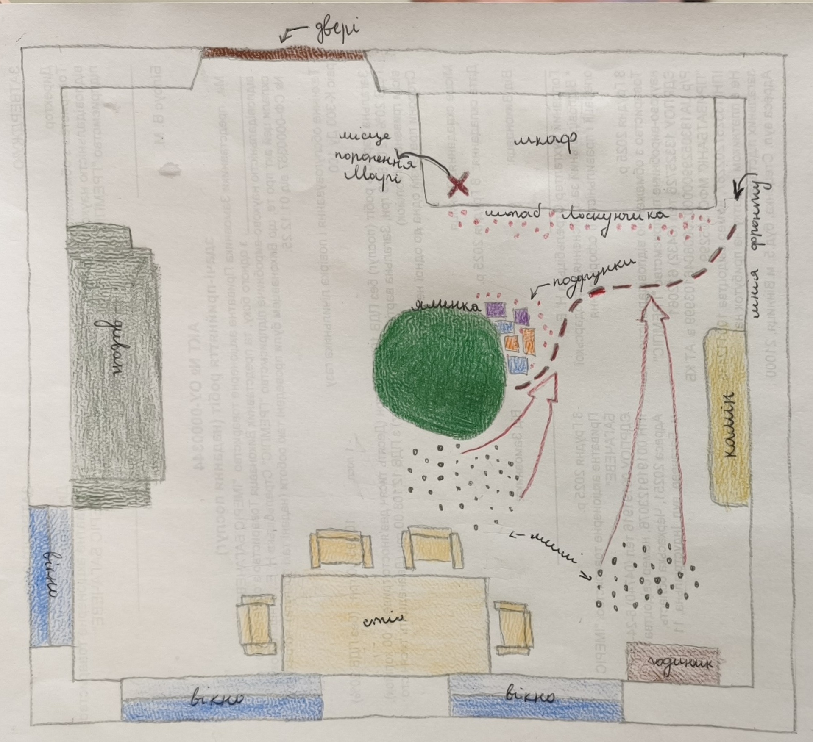

[` 🏡 Головна `](../../../../../README.md)   [` 📌 Завдання `](../../../../_main.md)

`2026-02-05 08-47`  
# 📌 Зарубіжна література T26036i47

> Виконані завдання можна надіслати на електронну пошту `natashahlovatska09@gmail.com`.  
> В листі обов’язково вказати ім’я, прізвище та клас.  

Прочитай і виконай завдання:  
[Лускунчик і Мишачий король - Фантастичні перетворення персонажів](https://docs.google.com/document/d/1sxfO1ycXrTbi3RoAAxYpZqzVyeb05FHJ/edit?usp=drive_link&ouid=105207416481981255920&rtpof=true&sd=true)

---

# ✔️ Виконання завдання

# 1. Літературний аналіз (Письмово)

## 1.1 Завдання «Шість голів зла»: Опишіть кожну з семи голів Мишачого короля як окремий людський порок. Наприклад: Голова №1 — Жадібність, Голова №2 — Брехня... Обґрунтуйте свій вибір.

> **Голова №1 Жадібність** - Мишиний король хоче забрати собі все і вбити лускунчика    
> **Голова №2 Мстивість** - Він хоче помститись за своїх братів та за смерть своєї мами  
> **Голова №3 Підлість** - Він шантажував Марі що вб'є лускунчика  
> **Голова №4 Войовничість** - Він постійно бажає воювати та вбивати    
> **Голова №5 та №6 Безсердечність та жорстокість** - Поводиться як безжальний тиран та прагне руйнувань   
> **Голова №7 Заздрість** - Він заздрить красі інших, бо сам він потвора    

## 1.2. Завдання «Аналіз почуттів»: Опишіть емоційний стан Марі в момент, коли вона бачить Лускунчика вперше і коли вона бачить його Принцом. Що змінилося в її сприйнятті?

> Від моменту коли Марі побачила Лускунчика вперше та коли вона побачила його принцом не змінилось нічого. 
бо для неї не важливий зовнішній вигляд, а важливий внутрішній світ та душа.

# 2. МИСТЕЦЬКИЙ ПРОЄКТ !!!

## Завдання «Карта пригод»: Намалюйте карту кімнати Штальбаумів, де відбулася битва. Позначте «лінію фронту», місце поранення Марі та штаб Лускунчика.

