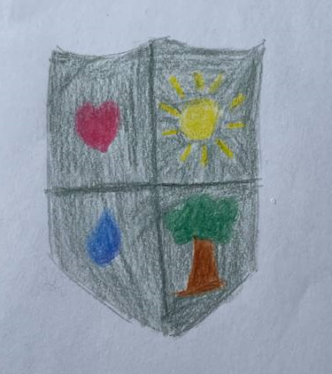

[` 🏡 Головна `](../../../../../README.md)   [` 📌 Завдання `](../../../../_main.md)

`2026-02-06 09-48`  
# 📌 Основи здоров'я T26037j48

> Виконані завдання можна надіслати в НЗ або на електронну пошту `natashahlovatska09@gmail.com`.  
> В листі обов’язково вказати ім’я, прізвище та клас.  

Прочитай і виконай завдання:  
[Бути людиною](https://docs.google.com/document/d/1jF0FXh3khKlhV5tj9AgQzNOQVfSqqSf_/edit?usp=drive_link&ouid=105207416481981255920&rtpof=true&sd=true)

---

# ✔️ Виконання завдання

## Завдання 1: «Піраміда моїх цінностей»

## Завдання 2: «Кейс ситуація»  

Ситуація: Твій однокласник розлив чай на свою нову сорочку. Всі навколо почали сміятися.
Завдання: Напиши 2 варіанти реакції:  
1) Як вчинить байдужа людина?  
2) Як вчинить Людина з великої літери?  

> Погана людина - вона буде сваритись з усіма або просто не допоможе.  
> Хороша людина - вона допоможе і підтримає. Вона не почне сміятись.  

## Завдання 3: «Мій герб людяності»  
Намалюй щит, розділений на 4 частини. У кожній частині зобразь символ того, що для тебе означає «бути людиною» (наприклад: серце — любов, рука — допомога, сонце — радість, книга — мудрість).

> Серце - це життя, добро, мир  
> Вода - це без чого людина не може існувати  
> Сонце - це радість, вітаміни D  
> Дерево - ще кисень, повітря, природа.