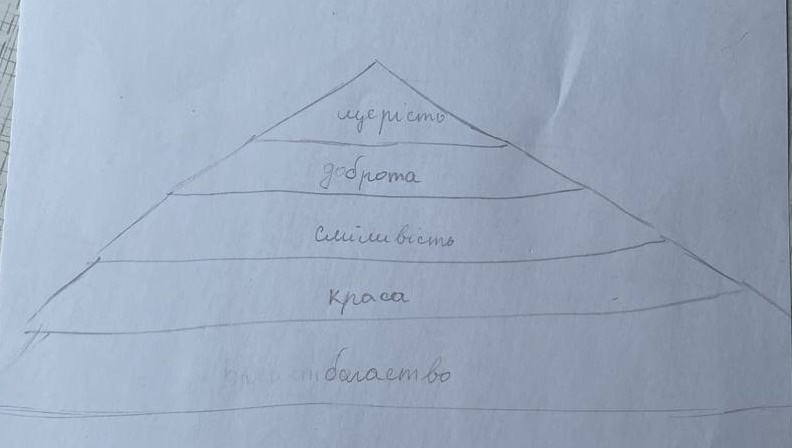

[` 🏡 Головна `](../../../../../README.md)   [` 📌 Завдання `](../../../../_main.md)

`2026-02-06 09-48`  
# 📌 Основи здоров'я T26037j48

> Виконані завдання можна надіслати в НЗ або на електронну пошту `natashahlovatska09@gmail.com`.  
> В листі обов’язково вказати ім’я, прізвище та клас.  

Прочитай і виконай завдання:  
[Бути людиною](https://docs.google.com/document/d/1jF0FXh3khKlhV5tj9AgQzNOQVfSqqSf_/edit?usp=drive_link&ouid=105207416481981255920&rtpof=true&sd=true)

---

# ✔️ Виконання завдання

Погана людина - вона буде сваритись з усіма або просто не допоможе.
Хороша людина - вона допоможе і підтримає. Вона не почне сміятись.

## Завдання 1: «Піраміда моїх цінностей»

## Завдання 1: «Піраміда моїх цінностей»